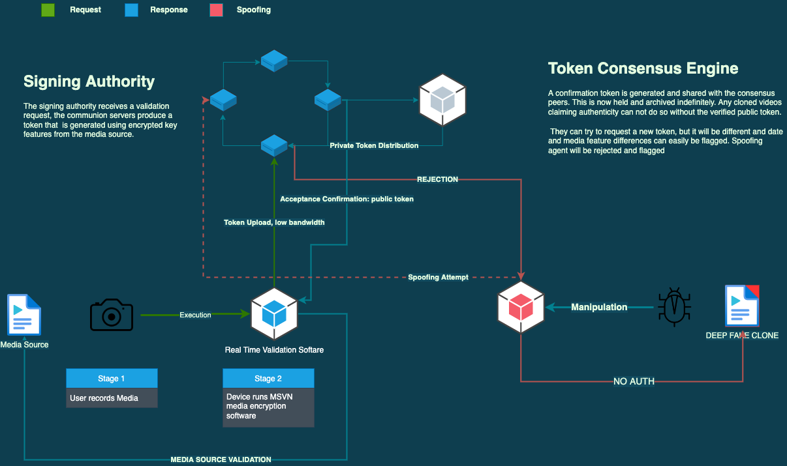

# MEDIA SOURCE VALIDATION NETWORK (MSVN)  
  
## COUNTERING DEEP FAKES  
  
  

### Problem Statement  

Deep-fakes whilst mostly easy to spot by a keen eye and a little bit of a technical background, it would be complacent to believe that detection software and technology will keep up with the pace of deception.  
  
At best case we may find ourselves in a situation where media sources becomes so distrusted that future generations will dismiss videos of attrocities and tragedies because they no longer know what to believe and have been duped so many times in the past.  
 This will make grass routes movements, court evidence and other significant elements in our society obsolete - which could in turn could cause grave damage to our systems and insitutions.  

### Current Approach 

 Currently multiple instituations and talented people are pursuing various avenues in combatting Deep Fakes, these include: 

- DeepFake detection AI
- Blockchain validation services
- Legal response such as the `DEEPFAKES Accountability Act was introduced in the House of Representatives` 
     
### Solution   
  
Below is a proposed architecture that would behave similar to private-public RSA encryption alongside TLS SSL certification standards.  

  
 
1. User generates Media on their device
2. The device runs `media encryption software` that is designed to be low intensity, high performance and uses algorithmic encoding of specific media features, along with other secrets that are defined by the `Communion Peers`. 
3. Authentication request token is sent to the designated `signing authority`. 
4. `Token Consensus Engine` validates the request, generates a communion side private token that is distributed amongst global Communion Peers, who retain local copies. 
5. Public authentication token is sent back to media owner, who can keep this as proof of origin. 
6. Spoofers do not have access to all global Communion peers at the same time, additioanlly the time of recording, device secrets are known only to the communion token consensus engine - fake requests are rejected and agent ip is flagge.d 

### Shortcomings  
  
- Man in the middle attacks are most likely to succeed if the time of recording is known and the validation token is seized by spoofer. However that does not allow the spoofer to edit the media file, only to claim authenticity.  

## Communion Peers  
  
A collection of authority bodies that are distributed accross the world and are custodians that are accountable for validated media. These custodians cycle data between all sites globally as to prevent collective localised fraud.   
  
Just like all other forms of respected institutions trust has to be gained over time, designated custodians should be rotated and randomised open source regulatory deep testing should be frequent and transparent.   

# Principles  

- Certification and peer approval network
- Degrees of Falibility: confidence rating
- Token recovery system
- Must be fast

# Ideas

- Communions are geospecific, so they allow faster upload and approval times
- Rotation Communions decide schemas for other communions picked at random or crowd selection
- Each step should add more info to encrypted value rather than less. 
- Consider request/response body
- Local encoder updates to boost auth rating but still can validate old
- Communions can outsource compute to block chain
